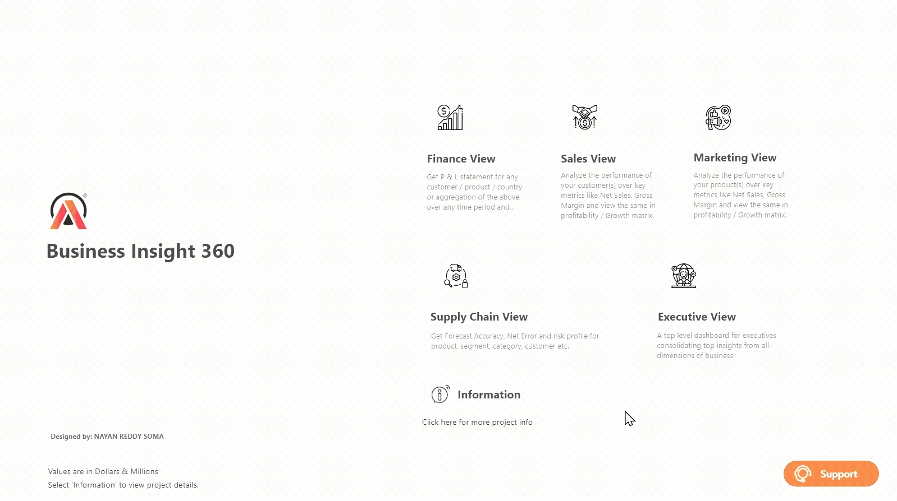
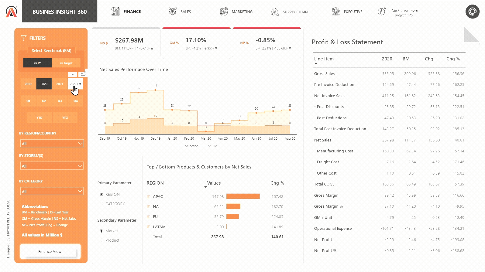
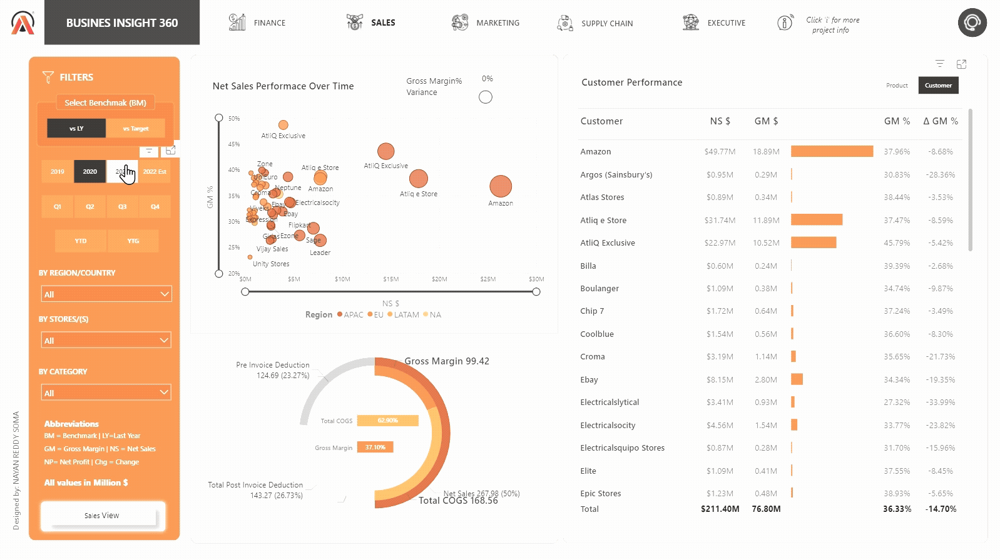
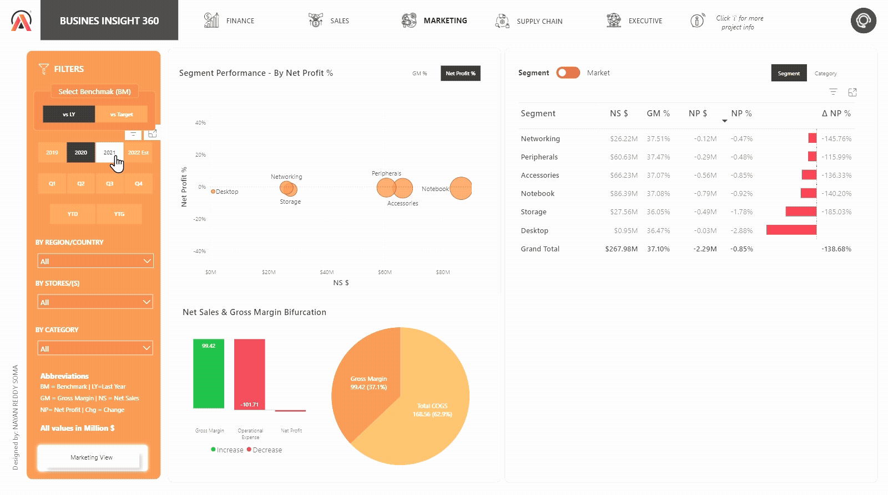
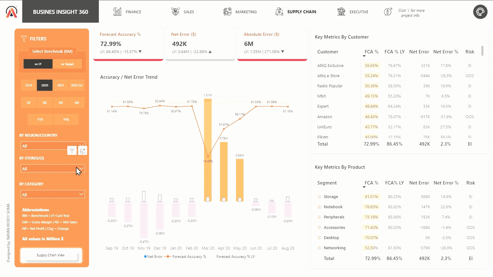
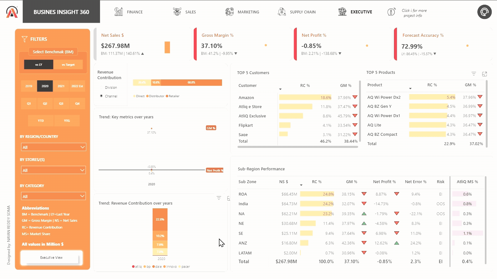
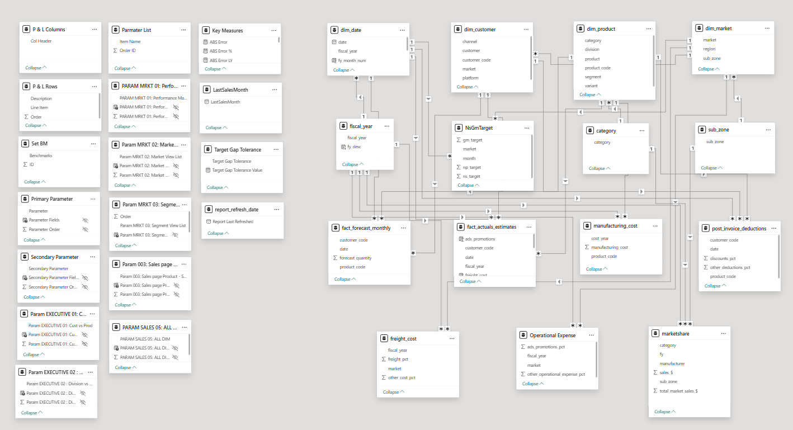

  <h1>Business Insights 360 📈</h1>

*An enterprise-grade Power BI dashboard providing a holistic, 360-degree view of business performance, designed to transition a growing company from intuition-based decisions to a data-driven culture.*

---

## 🚀 Live Interactive Dashboard

  <strong>📂 Power BI Project File (.pbix):</strong>

  <strong><a href="https://drive.google.com/file/d/1brYjsIUAt1XpTBD0lYm2XDfht7R-tv0y/view?usp=drive_link">➡️ Download the project file here</a></strong>

 

  <strong>Interact with the live dashboard to experience its full functionality.</strong>

  <strong><a href="https://app.powerbi.com/view?r=eyJrIjoiYzFkZGY3NGUtMWIwYy00YjZmLWIzMDYtYjQyMjkxNGRhN2NmIiwidCI6ImM2ZTU0OWIzLTVmNDUtNDAzMi1hYWU5LWQ0MjQ0ZGM1YjJjNCJ9">➡️ Interact with the Live Demo Here</a></strong>

 

  

---

## 📖 Table of Contents

- [Project Context & Business Problem](#-project-context--business-problem)
- [Dashboard Pages](#-dashboard-pages)
- [Technical Deep Dive](#-technical-deep-dive)
- [Dashboard Features & KPIs](#-dashboard-features--kpis)
- [Key Skills & Techniques Showcase](#-key-skills--techniques-showcase)
- [How to Use This Repository](#-how-to-use-this-repository)
- [Contact](#-contact)

---

## 🎯 Project Context & Business Problem

**AtliQ Hardware**, a rapidly growing computer hardware company, has historically relied on intuition and basic Excel analysis for its decision-making. After a significant financial loss from a new store opening in America and facing intense competition from data-savvy rivals, the management team recognized the urgent need to adopt a data-driven culture.

The "Business Insights 360" dashboard was commissioned as the company's first major data analytics initiative. Its primary goal is to provide a single, reliable source of truth that empowers stakeholders across **Finance, Sales, Marketing, and Supply Chain** to make strategic decisions backed by data, not intuition.

---

## 📊 Dashboard Pages

Here is an overview of the five dedicated pages within the "Business Insights 360" report.

### 1. Finance View
*A dynamic Profit & Loss statement allowing for deep dives into financial performance against targets and previous years.*

  

### 2. Sales View
*An analysis of sales performance, with dynamic slicing by customer vs. product and new vs. existing customers.*

  

### 3. Marketing View
*A strategic look at profitability by product category and market segment, featuring a dynamic performance matrix.*

  

### 4. Supply Chain View
*An operational dashboard focused on forecast accuracy and identifying inventory risks like "Out of Stock" or "Excess Inventory."*

  

### 5. Executive View
*A high-level overview of business health, focusing on top performance metrics, market share and revenue contribution.*

  

---

## 🛠️ Technical Deep Dive

This project showcases the end-to-end process of building a business intelligence solution, from raw data to actionable insights.

### 1. ETL & Data Modeling
* **Data Integration:** The project began by integrating data from a hybrid environment, combining transactional records from a **SQL database** with supplementary data from multiple **CSV files**.
* **ETL with Power Query:** A rigorous cleaning and transformation process was performed in Power Query. This included handling null values, correcting data types, removing duplicates, and creating a custom Date table using M language to support time intelligence.
* **Advanced Data Model:** A **Galaxy Schema** was implemented to manage the complex relationships between different business processes. This model features multiple fact tables (e.g., `fact_actuals_estimates`, `fact_forecast_monthly`, `marketshare`) and shared, conformed dimension tables (`dim_date`, `dim_product`, `dim_customer`). This design is scalable and optimized for performance. The model includes:
    - `dim_customer`: **75** distinct customers across **27** markets.
    - `dim_product`: **14** product categories across **3** main divisions.
    - `dim_market`: **27** markets across **4** major regions (APAC, EU, etc.).

  

### 2. DAX for Advanced Analytics
The analytical power of this dashboard comes from a library of over 30 DAX measures. These measures don't just calculate numbers; they translate data into business insights.

* **Finance View - Dynamic P&L Statements:**
    * A fully interactive Profit & Loss statement was created using a combination of `SWITCH(TRUE())` and `HASONEVALUE`.
    * Implemented a **switchable benchmark** feature, allowing users to compare performance against `Last Year` or `Target` values dynamically.

* **Sales & Marketing - Flexible Performance Analysis:**
    * Used **Field Parameters** to allow users to dynamically switch the dimensions of the analysis (e.g., view sales by `Product` vs. `Customer`, or profitability by `Category` vs. `Segment`).

* **Supply Chain - Actionable Risk Classification:**
    * Calculated key forecasting metrics like `Forecast Accuracy %` and `Net Error %`.
    * Wrote a measure that translates raw error data into actionable business risk categories: **"EI" (Excess Inventory)** or **"OOS" (Out of Stock)**.
    * Used **Time Intelligence** functions like `CALCULATE` to perform Year-over-Year comparisons of forecast accuracy.

* **Executive View - Strategic & Competitive Analysis:**
    * Developed a `Revenue Contribution %` measure using `CALCULATE` and `ALL()` to show how any slice of the business contributes to the grand total.
    * Calculated **Market Share %** and filtered it to show the company's competitive standing (`AtliQ MS %`), moving beyond internal metrics to provide strategic market insights.

* **Dynamic Visuals:** Used **Field Parameters** across multiple pages to allow users to dynamically switch the dimensions of the analysis (e.g., view sales by `Product` vs. `Customer`).

---

## ✨ Dashboard Features & KPIs

The dashboard is divided into five pages, each tailored to the needs of a specific business function.

| View | Key Performance Indicators (KPIs) | Key Features |
|---|---|---|
| **Finance** | Net Sales, Gross Margin %, Net Profit % | Dynamic P&L Matrix, Switchable Benchmarks (vs. Target/Last Year). |
| **Sales** | Net Sales, Gross Margin, Customer Growth | Dynamic Slicing by Product vs. Customer, New vs. Existing Customer analysis. |
| **Marketing**| Net Profit %, Gross Margin %, Unit Economics | Performance Matrix, Dynamic KPI switching (GM% vs NP%). |
| **Supply Chain** | Forecast Accuracy %, Net Error % | Risk Classification (OOS/EI), Year-over-Year forecast performance. |
| **Executive** | Market Share %, Revenue Contribution % | Competitive Analysis, High-level slicing by Division vs. Channel. |

---

## 💡 Key Skills & Techniques Showcase

This project demonstrates proficiency in a wide range of technical and business skills.

| Category | Skills & Techniques |
|---|---|
| **Power BI Development** | Data Modeling (Galaxy Schema), DAX (Time Intelligence, `CALCULATE`, `SWITCH`), Power Query (M Language), Calculated Columns & Measures, Bookmarks, Page Navigation, KPI Indicators, Conditional Formatting, Data Validation. |
| **BI Services & Deployment** | Publishing Reports to Power BI Service, Workspace Collaboration, Access Permissions, App Creation, Scheduled Refresh with Gateway. |
| **Performance Optimization**| Balancing calculations between Power Query and DAX, using DAX Studio to analyze model performance. |
| **Business Acumen** | Understanding of core business terms like Gross Margin, COGS, Net Sales, P&L Statements, and key operational metrics for Sales, Marketing, and Supply Chain. |

---

## 📂 How to Use This Repository

* **Live Demo:** The best way to experience this project is through the **[Live Interactive Dashboard](https://app.powerbi.com/view?r=eyJrIjoiYzFkZGY3NGUtMWIwYy00YjZmLWIzMDYtYjQyMjkxNGRhN2NmIiwidCI6ImM2ZTU0OWIzLTVmNDUtNDAzMi1hYWU5LWQ0MjQ0ZGM1YjJjNCJ9)**.
* **`.pbix` File:** You can download the complete Power BI project file from the cloud service **[here](https://drive.google.com/file/d/1brYjsIUAt1XpTBD0lYm2XDfht7R-tv0y/view?usp=drive_link)** to explore the data model, DAX measures, and Power Query transformations in Power BI Desktop.

---

## 📫 Contact

I am a passionate data analyst dedicated to turning complex data into clear, actionable insights. If you have any questions about this project or would like to connect, please feel free to reach out.

* **Email:** <nayanreddy007@gmail.com>
